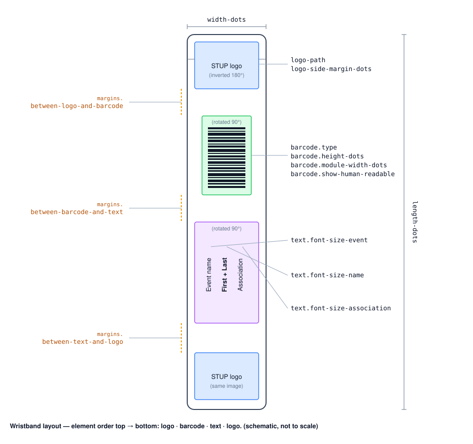

# Configuration

[← Back to README](../README.md)

Settings are grouped below by area. Wristband geometry (dimensions, spacing, fonts, barcode) has
its own [Wristband layout](#wristband-layout) section with a diagram.

## Printer & routing

| Property | Default | Description |
|---|---|---|
| `cluster.printers` | sentinel | **Management** printer registry: list of `{id, display-name, base-url}`, one per printer. Override per environment — see the compose files |
| `printer.host` | `localhost` | Zebra printer IP/host — **set per worker** via `PRINTER_HOST`; unused by management |
| `printer.port` | `9100` | Zebra printer TCP port (per worker) |
| `printer.timeout-ms` | `5000` | Socket connection timeout (ms) |
| `printer.max-retries` | `2` | Extra attempts after the first on a transient socket failure |
| `printer.retry-backoff-ms` | `500` | Pause between retry attempts (ms) |
| `printer.clear-cache-enabled` | `true` | Prepend a clear command to every job. Images are sent inline (`^GFA`) and never stored, so this is normally a no-op — it guards against object build-up in printer memory that historically stalled the printer after a number of prints |
| `printer.clear-command` | `^XA^IDR:*.*^FS^XZ` | ZPL prepended before each label when clearing is enabled. Wipes objects from the printer's **RAM drive (R:)** only — no flash wear. Override if your printer model needs a different command |
| `queue.max-depth` | `100` | Max pending jobs **per printer** before new submissions are rejected with HTTP 429 |

## Integrations & security

| Property | Default | Description |
|---|---|---|
| `labelary.base-url` | `http://api.labelary.com` | Labelary API base URL (preview rendering) |
| `security.api-key` | `changeme` | Static API key — override in production; shared by management + workers |

**Profile activation:**
- Management — local: `--spring.profiles.active=local`
- Management — production: `SPRING_PROFILES_ACTIVE=prod`
- Worker (printer node): `SPRING_PROFILES_ACTIVE=worker` (no DB/UI; needs `PRINTER_HOST` + `SECURITY_API_KEY`)

> Under the `prod` profile the application refuses to start if `security.api-key` is unset, blank,
> or left at the default `changeme` — set `SECURITY_API_KEY` to a real value.

## Wristband layout

The band is generated programmatically as ZPL — there are no absolute coordinates to maintain. You
set the band dimensions, the gaps between elements, and the font/barcode sizes; the service centres
everything and stacks the elements in this fixed order, from the non-adhesive end to the adhesive end:

**logo → barcode → text (event / name / association) → logo**

The diagram below maps each setting to the element it controls. Orange labels (left) are the gaps
between elements; the labels on the right size the elements themselves.

**Band dimensions & spacing**

| Property | Default | Controls |
|---|---|---|
| `wristband.width-dots` | `300` | Band width (across), in dots |
| `wristband.length-dots` | `3300` | Band length (along), in dots |
| `wristband.dpi` | `300` | Printer resolution (203 or 300) |
| `wristband.logo-path` | `classpath:images/stup-logo.png` | STUP logo PNG — bundled in the JAR, no external file needed |
| `wristband.logo-side-margin-dots` | `75` | Left/right margin around each logo, in dots |
| `wristband.margins.between-logo-and-barcode` | `30` | Gap: top logo → barcode |
| `wristband.margins.between-barcode-and-text` | `120` | Gap: barcode → text block |
| `wristband.margins.between-text-and-logo` | `120` | Gap: text block → bottom logo |

**Text & barcode**

| Property | Default | Controls |
|---|---|---|
| `wristband.text.font-size-event` | `45` | Font height of the event-name line |
| `wristband.text.font-size-name` | `74` | Font height of the first + last name line (largest) |
| `wristband.text.font-size-association` | `45` | Font height of the association line |
| `wristband.barcode.type` | `CODE128` | Barcode symbology |
| `wristband.barcode.height-dots` | `270` | Barcode height (across the band), in dots |
| `wristband.barcode.module-width-dots` | `3` | Narrow-bar width — wider = longer along the band & easier to scan |
| `wristband.barcode.show-human-readable` | `false` | Print the value as text next to the barcode |

> **Calibration:** every position derives from the values above — no code changes needed. After a
> first test print, tune `wristband.margins.*` and `wristband.text.*` in `application-prod.yml`.
